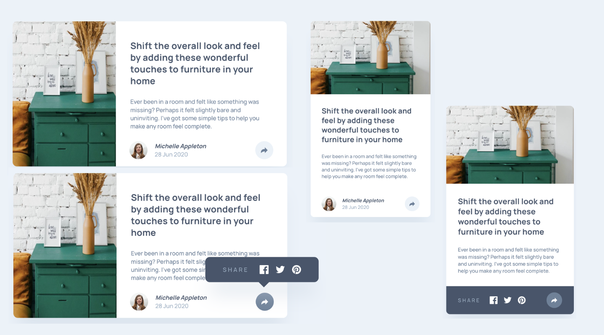

# Frontend Mentor Challenge

This is my solution to the [Article preview component](https://www.frontendmentor.io/challenges/article-preview-component-dYBN_pYFT) challenge on Frontend Mentor.

## Table of contents

- [Overview](#overview)
  - [The challenge](#the-challenge)
  - [Screenshot](#screenshot)
  - [Links](#links)
- [My process](#my-process)
  - [Built with](#built-with)
  - [What I learned](#what-i-learned)
  - [Continued development](#continued-development)
  - [Useful resources](#useful-resources)
  - [AI Collaboration](#ai-collaboration)
- [Author](#author)
- [Acknowledgments](#acknowledgments)

## Overview

### The challenge

Users should be able to:

- View the optimal layout for the component depending on their device's screen size
- See the social media share links when they click the share icon

### Screenshot



### Links

- Solution URL: [Source Code](https://github.com/irfanoezen/article-preview-component)
- Live Site URL: [Preview](https://irfanoezen.github.io/article-preview-component/)

## My process

### Built with

- Semantic HTML5 markup
- CSS custom properties
- Font faces
- CSS Flexbox
- CSS Grid
- Mobile-first workflow
- Vanilla JavaScript

### What I learned

How to position an image within a container?

```css
.article__img {
  ...
  object-fit: fill;
  object-view-box: inset(30px 0 90px 0);
}
```

How to create a triangle with CSS borders?

```css
.article__popup::after {
  ...
  width: 0;
  height: 0;
  box-shadow: 0 40px 40px -10px hsla(210, 29%, 84%, 50%);
  border-top: 12px solid var(--grey-900);
  border-left: 12px solid transparent;
  border-right: 12px solid transparent;
}
```

How to get the window size?
```js
window.innerWidth
```

### Continued development

I want to focus more on Vanilla Javascript in future projects. And I want to get more confident with responsive design and responsive behavior.

### Useful resources

- [CSS triangle with borders](https://css-tricks.com/snippets/css/css-triangle/) - I really liked this guide and will use it future projects.
- [Positioning image within a container](https://developer.mozilla.org/en-US/docs/Web/CSS/Reference/Properties/object-view-box) - This documentation helped me finally understand image positioning. I'd recommend it to anyone still learning this concept.

### AI Collaboration

I'm just using GitHub Copilot with the provided files from Frontend Mentor, to just get guided assistance and not finished code or even code snippets.

## Author

- [Website](https://www.your-site.com)
- Frontend Mentor - [@irfanoezen](https://www.frontendmentor.io/profile/irfanoezen)
